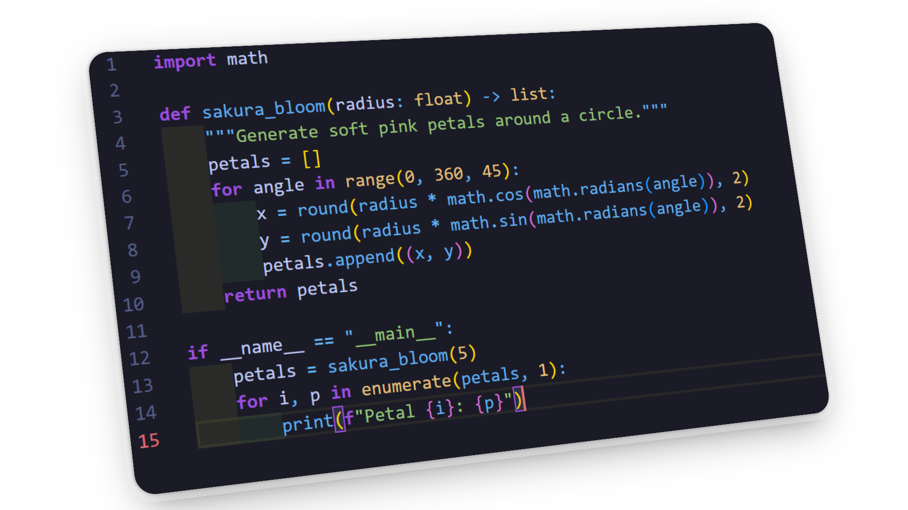
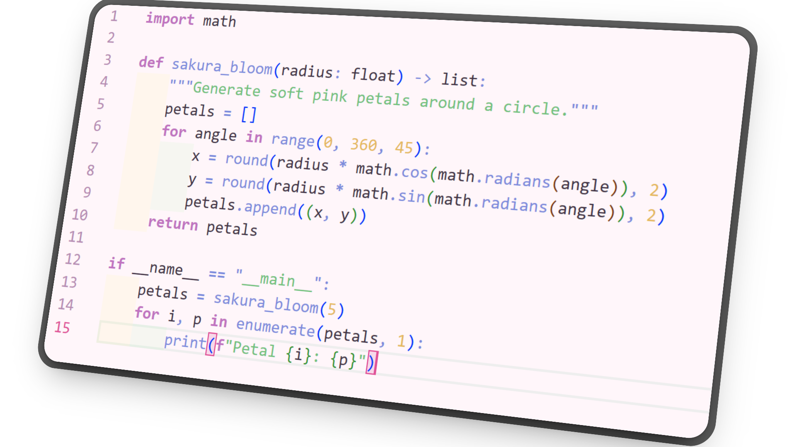

<h1 align="center">Sakura X — VS Code Theme</h1>

  
  
  

  <b>Version:</b> Beta 0.0.6 · <b>Theme Family:</b> Sakura X 
  <b>Original Author:</b> <a href="https://github.com/cnrxad">cnrxad</a>

---

## 🌺 About

**Sakura X** is a refined Visual Studio Code theme family that balances **elegance and contrast** across both dark and light modes.  
Inspired by the harmony between **shadow and light**, it combines **subtle pastels**, **vivid neons**, and **deep neutral tones** to create a comfortable, expressive coding experience in any environment.

> Designed with precision, built with intention — made to feel like calm productivity.

---

## 💾 Installation

1. Open the **Extensions** sidebar in Visual Studio Code.
2. Search for **“Sakura X”**.
3. Click **Install**, then choose your preferred variant:
   - 🌑 **Kuro Sakura** (Dark)
   - 🌕 **Shiro Sakura** (Light)

---

## 🎨 Previews

### 🖤 Kuro Sakura (Dark)

### 🤍 Shiro Sakura (Light)

---

## 💖 Sponsors & Collaboration

We’re currently looking for:
- 🎨 A **designer** for the Sakura X identity  
- 🌸 Theme testers and visual feedback contributors

Interested?  
👉 [Become a sponsor!](mailto:cnrxad@gmail.com?subject=Sakura%20X%20Sponsor%20Request)

---

## 🧾 License

This project is licensed under the **Creative Commons Attribution 4.0 International (CC BY 4.0)**.  

**Copyright (c) 2025 Sakura X**  

You are free to:  
- **Share** — copy and redistribute the material in any medium or format  
- **Adapt** — remix, transform, and build upon the material for any purpose, even commercially  

**Under the following terms:**  
- **Attribution** — You must give appropriate credit to **Sakura X**, provide a link to the license, and indicate if changes were made. You may do so in any reasonable manner, but not in any way that suggests the licensor endorses you or your use.  
- **No additional restrictions** — You may not apply legal terms or technological measures that legally restrict others from doing anything the license permits.  

**Full license text:** [https://creativecommons.org/licenses/by/4.0/legalcode](https://creativecommons.org/licenses/by/4.0/legalcode)  

You may modify and redistribute the theme, but **you must credit the original project: Sakura X**.

---

  Made with calm precision · © 2025 <a href="https://github.com/cnrxad/sakura-x">Sakura X</a>

